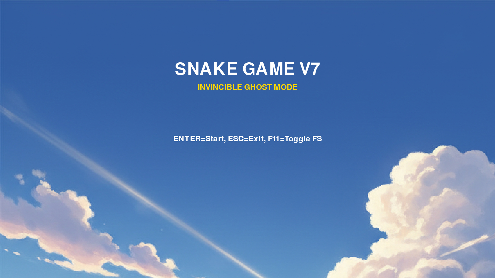
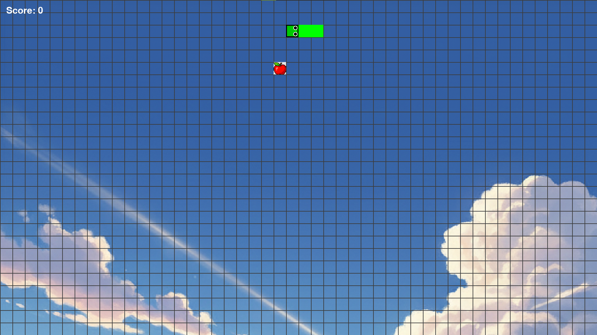
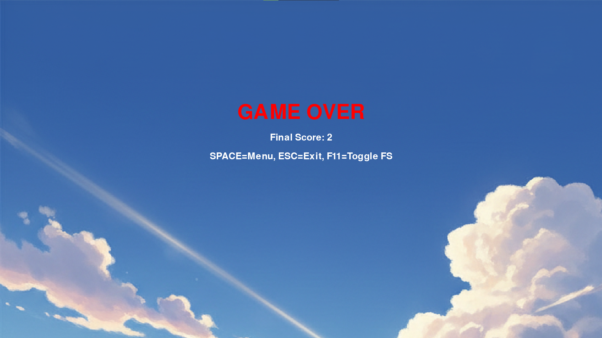

# Snake Game in Python 🐍🎮

This is a classic Snake Game built using Python and Pygame.  
I am developing this project as part of my learning journey towards **Google Summer of Code (GSoC 2026)**.

---

## 🚀 Features
- Smooth snake movement
- Score system
- Food appears randomly
- Game over detection
- Keyboard controls for snake movement

---

## 🛠 Tech Used
- **Python**
- **Pygame**
- **Git & GitHub**


 ---

📂 Folder Structure
```bash
Snake-Game/
│
├── Images/
│   ├── apple.png
│   ├── berry.png
│   ├── bluesky.png
│
├── snake_game_v6.py
└── README.md
 ```
 
 ---


## ▶️ How to Run
1. Install Python 3.11 or above  
2. Install pygame:
   ```bash
   pip install pygame
3. Run the game:
 ```bash
git clone https://github.com/Sanchit122006/snake_game_v6.git
cd snake-game-v6
python snake_game_v6.py


 ```
    

✨ Updated Features

 🍎 Apple = +1 point

 🫐 Berry = +5 points

 👻 Ghost Mode power-up (temporary wall-pass ability)

 🌄 Beautiful background theme

 💥 Game Over detection

 🎯 Score display

 ⌨ Smooth keyboard controls


 ---


## 📸 Game Screenshots

### 🏁 Main Menu


### 🎮 Gameplay


### 💀 Game Over Screen


 ---

 

 🕹 Controls

| Key       | Action                  |
| --------- | ----------------------- |
| ⬅️ / ➡️   | Move Left / Right       |
| ⬆️ / ⬇️   | Move Up / Down          |
| **Enter** | Start Game (from Menu)  |
| **R**     | Restart after Game Over |
| **Q**     | Quit Game               |


 ---


🌍 Motivation

I am improving this project step-by-step to learn:

Game Development

Git & GitHub workflow

Clean code practices

Open-Source contribution (GSoC path)


 ---


### Version History
| Version  | Update Summary                             |
| -------- | ------------------------------------------ |
| **v1.0** | Basic movement + food + game over          |
| **v2.0** | Added Score system + Better UI             |
| **v3.0** | Added Berries (+5 points)                  |
| **v4.0** | Menu Screen Added                          |
| **v5.0** | Background Image Support                   |
| **v6.0** | Ghost Mode Power-up + Performance improved |
| **Next** | Sound effects + Animation + More power-ups |


 ---

 🔮 Future Plans

🧊 Freeze power-up

🐍 Skins for Snake

🎵 Sound & animations

🏆 High score saving

Multiplayer mode (maybe!)


 ---


 🤝 Contributing

Anyone is welcome to suggest improvements!
I’m also exploring contribution to open-source game dev organizations.


 ---


 ⭐ Show Support

If you liked this project:

Star ⭐ the repository

Follow for future updates 🧠